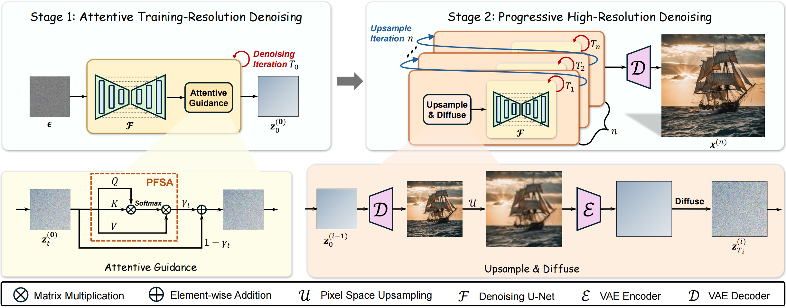
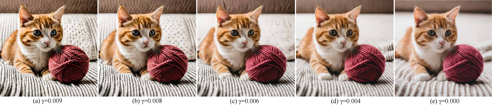

# AP-LDM
Official implementation of [***AP-LDM: Attentive and Progressive Latent Diffusion Model for Training-Free High-Resolution Image Generation***](https://arxiv.org/abs/2410.06055v1).

The ControlNet version and video generation are coming soon!

 

**AP-LDM** is a framework that enables the rapid synthesis of high-quality, high-resolution images without the need for retraining.

It consists of two stages: (1) synthesizing high-quality images at the training resolution using **Attentive Guidance**, and (2) generating finer high-resolution images through pixel upsampling and "diffusion-denoising."

## Overview of AP-LDM
 
* Attentive Guidance enhances the structural consistency of the latent representation using a parameter-free self-attention mechanism, which is achieved through linear weighting.
* It allows users to adjust the linear weighting factor of Attentive Guidance (_i.e._, `attn_guidance_scale`) to synthesize the desired images. For example, as shown in the figure below, using a larger guidance scale may result in more details, richer colors, and stronger contrast.

* When using Attentive Guidance, it is necessary to delay its effect by 3 to 5 steps (in the case of 50-step sampling), which results in higher-quality images.
* In the second stage, AP-LDM divides the upsampling process into several sub-stages, where the number of sub-stages can be specified. Additionally, the number of diffusion-denoising steps in each sub-stage can also be specified. This is achieved by providing an initialization rate list (i.e., `init_rates`).

## Text to Image Generation

    conda create -n apldm python=3.9
    conda activate apldm
    pip install -r requirements.txt

## Parameter
* `gpu_ids`: Determines which GPU to use. If set to `None`, the CPU will be used.
* `image_sizes`: The size of the generated images, input as a list, allowing multiple sizes to be specified.
* `init_rates`: Determines the number of upsampling steps and the extent of the diffusion-denoising process after each upsampling.
* `attn_guidance_scale`: The linear weighting factor of Attentive Guidance.
* `attn_guidance_density`: Determines which steps use Attentive Guidance.
* `attn_guidance_decay`: The decay method of the Attentive Guidance scale; if set to `None`, no decay is applied.
* `multi_encoder`: Determine whether to use a tiled encoder.
* `multi_decoder`: Determine whether to use a tiled decoder.
* `models_to_cpu`: Determines whether to transfer other model weights to the CPU during model encoding and decoding.
* `encoder_limit_area`: Use tilde_encoder when exceeding this resolution.
* `decoder_limit_area`: Use tilde_decoder when exceeding this resolution.
* `num_inference_steps`: The number of denoising steps in the first stage. More denoising steps usually lead to a higher quality image at the expense of slower inference.
* `num_resample_timesteps`: Determines the number of diffusion steps during the upsampling stage.

## Generating with/without Attentive Guidance
 

## Acknowledgments & Related Work
Special Thank to the great project - [***DemoFusion***](https://github.com/PRIS-CV/DemoFusion).

At the same time, we would like to extend our gratitude to other related works for providing us with invaluable references.
[***MultiDiffusion***](https://github.com/omerbt/MultiDiffusion)
[***ScaleCrafter***](https://github.com/YingqingHe/ScaleCrafter)
[***AccDiffusion***](https://github.com/lzhxmu/AccDiffusion)
[***SDXL***](https://github.com/Stability-AI/generative-models)
[***Stable Diffusion***](https://github.com/Stability-AI/StableDiffusion)
